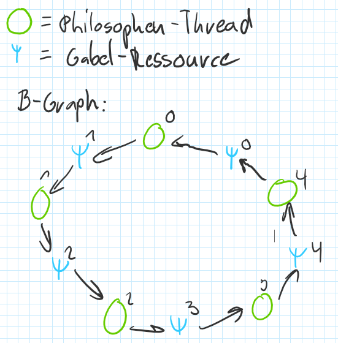

# ParProg: Testat 1 

### Aufgabe 1: Broken Cyclic Barrier

Die Latch wird jede Runde von Thread mit Nummer 0 zurückgesetzt. Dies ist halt nicht korrekt, da es dabei eine Race Condition gibt. Zudem ist der Zugriff auf die Latch-Referenz ungenügend synchronisiert, was zu einem Data Race führt.            

### Aufgabe 2a: Betriebsmittelgraph

Betriebsmittelgraph zeigt Deadlock auf:



### Aufgabe 2b: Dining Philosophers

```java
table.acquireFork(leftForkNo); 
while (!table.tryAcquireFork(rightForkNo)) { 
  table.releaseFork(leftForkNo); 
  // … 
  table.acquireFork(leftForkNo);  
} 
```

Es kann hier zu einer Starvation kommen, falls ein Thread nie eine Gabel aufnehmen kann

### Aufgabe 3a: Upgradeable Read-Write Locks

Es darf nur auf ein Write-Lock erweitert werden, also muss bei den Read-Locks schon geprüft werden ob ein Thread ein Upgradable Read-Lock besitzt. Somit ist allen anderen Threads klar wer das Write-Lock erhält und kein anderer Thread kann zuvorkommen.

